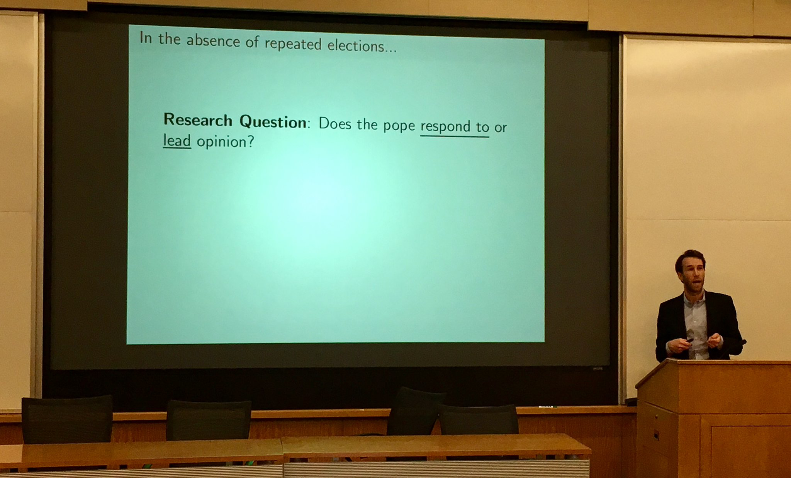

    

    
        

	
        

        

            Jeff Ziegler 
            <a href="https://www.tcd.ie/Political_Science/">Department of Political Science</a> 
            <a href="https://www.tcd.ie/">Trinity College Dublin</a> 
            Ireland  

            

            Email: <code>zieglerj</code><b>I don't</b><code>@</code><b>want</b><code>t</code><b>spam!
            </b><code>cd</code><code>.</code><b>please</b><code>i</code><b>leave
            </b><code>e</code><b>me</b><b>alone</b><b>!</b>
	

    

    
    
<link href="https://assets.calendly.com/assets/external/widget.css" rel="stylesheet">

